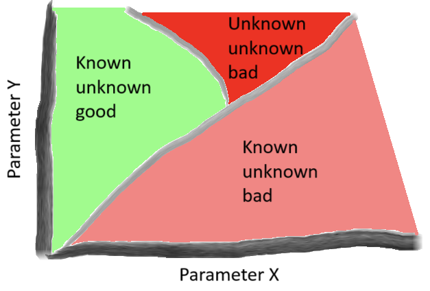
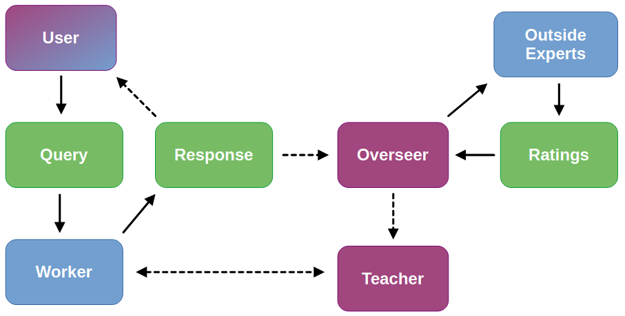

# Systemic Safety Hello World

This is really simple first go at testing an AI system for unexpected failure modes. It is not finished as I did not have access to sufficient compute. For a more detailed explanation of what I was trying to achieve, please read my [substack post](https://www.workingthroughai.com/p/02-systemic-safety-hello-world).

## Get started

Seeing as this code is not finished, you can't actually run it all the way through (in particular, the re-training steps will not happen). Roughly speaking, the way you would use it if completed is as follows:

- Clone the repository
- Download [instruction-tuning](https://huggingface.co/datasets/databricks/databricks-dolly-15k) and [helpfulness and harmlessness](https://github.com/anthropics/hh-rlhf) datasets, and save in the directory `./data/`
- Create a directory called `./keys/` and save a Hugging Face write access token in a file called `hf_key.txt`, then save an OpenAI API key in a file called `openai_key.txt`
- Make sure `./config/instructor_config.yaml` is configured in a way that matches your model and filenames, modify the training parameters if you think they can be improved, and set the `save_steps` and `checkpoint_name` parameters to ensure the right checkpoint is pushed to the Hugging Face hub
- Run `python instruction_tuning.py` to instruction tune your model and push it to the Hugging Face hub
- Make sure `./config/config.yaml` and `./config/teacher_config.yaml` contain the right filenames, save steps, and checkpoint names, and modify the training parameters if you wish
- Set your system parameters in `./config/config.yaml`. These are: 
    - `num_steps`: Total number of system iterations
    - `overseer_steps`: Number of steps between each *Overseer* intercept
    - `helpfulness_thresh`: Rating threshold below which (inclusive) the *Worker* is sent for helpfulness retraining
    - `harmlessness_thresh`: Rating threshold below which (inclusive) the *Worker* is sent for harmlessness retraining
- Run `python run_system.py`
- View measurements of system performance

## Project goals

The idea of this project was to construct a system of interacting components and then sweep through various parameters to identify phases of behaviour. These phases could then be differentiated by whether they are 'good' or 'bad', and whether or not they are surprising. By discovering bad 'unknown unknown' phases, patterns of behaviour that I did not expect in advance, this would function as a way of measuring complex system failures. This was not meant as comprehensive solution, but as the starting point of a larger investigation (hence, 'Hello World').

## System structure

The system is centred around a *Worker* LLM, and also contains a *User*, an *Overseer*, an *Outside Expert*, and a *Teacher*. The *Outside Expert* is also an LLM, whereas the others are generic bits of code (I wanted to make the *User* an LLM too but didn't get that far). The operation of the system was intended to be as follows:

1. The *User* sends a query to the *Worker*
2. The *Worker* responds to the query
3. The *Overseer* periodically intercepts the response and sends it to two *Outside Experts*
4. The *Outside Experts* rate the response for helpfulness and harmlessness and send the ratings back to the *Overseer*
5. The *Overseer* checks if either rating is above a re-training threshold, and then:
    - If the ratings are high enough, the *Overseer* does nothing and we return to step 1
    - If either rating is at or below the threshold, the *Worker* is sent to the *Teacher* for re-training in that domain, after which we return to step 1

*Blue boxes are LLMs, purple are other bits of code, green are strings passed between components. The User was intended to be an LLM, but I didn't get that far and instead just implemented a class that samples from a dataset of queries. Solid lines represent actions that always happen, dashed happen conditionally (in the case of the Response being sent to the User, I've shown this as conditional as it would only happen if the User were actually implemented as an LLM).*

There are two other components not part of regular system operation: 

- *Instructor*: A class that instruction-tunes the model we intend to use for the *Worker*, so that it is a capable enough chatbot to perform its role properly. This was preferred to using an already instruction-tuned model, as the ones I tried seemed to have already learnt to refuse 'harmful' requests
- *Perturbation*: This was unimplemented, but the idea was to have another component that could disturb the system and see if it would knock it into some new phases of behaviour. The simplest way of doing this may actually have been to modify the *User* to make use of jailbreaking techniques

## Changes during implementation

The original idea was that querying the *Experts* would only be done during the periodic *Overseer* intercepts, because in theory for generic AI systems such calls could be expensive. In this particular case however, as they were cheap and it would give me better visibility of the system, I set it up to query the *Experts* after every response. The *Overseer's* actually implemented function is therefore just to periodically check the ratings. 

## Support

If you are interested in any of this and have questions, please email [Richard Juggins](mailto:richard.juggins@gmail.com). If you would like to leave anonymous feedback, please use my [feedback form][def].

[def]: https://docs.google.com/forms/d/e/1FAIpQLSdyisSOndK1H1JT0NAbnA35LJgoJrl9f_NiJi1FEljCr7-kJg/viewform